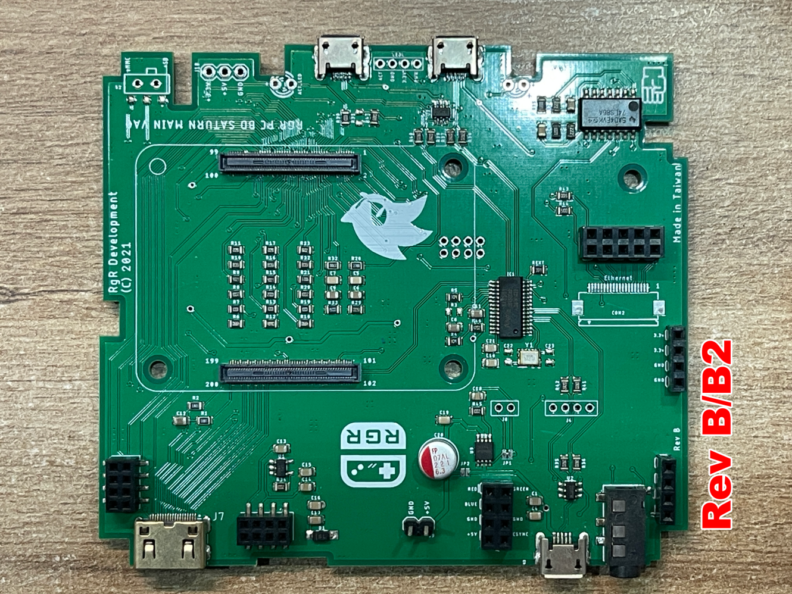

# RGR MiniSS Mainboard RevA/RevB modification instrusction for Raspberry Pi CM5
---
# Revisions
**RevA**

**RevB**

---
# Power/Voltage not enough issue

**Disable that on-board power switch chip**

**Step1.** Cut JP1 with knifce and then short JP2 with solder

**Step2.** Locate two 5V points we need to connect

**Step3.** Connect these two solder points with 22AWG/20AWG wire.

---
# SD card is not detected issue (for RevA only)

For older bootloader of CM4 Lite, this issue is not a problem at all. But with some newer CM4 with newer bootloader programmed, the SD power deliver is not working right with the **VERY First Batch of RevA board**. If your board still not possibel to detect the SD card with your CM4 Lite/CM5 Lite then you can try to provide the power for SD card via this modification.  **BTW, if your are not using the LITE ver of Raspberry Pi ComputeModel, it wont boot from SD card. Non-Lite version will boot from internal eMMC directly**

If there is no **3.3V** on Pin2, then you can **wire Pin1 to Pin2 manually**, then it will force the 3.3v to deliever to power source for the SD card.

---
