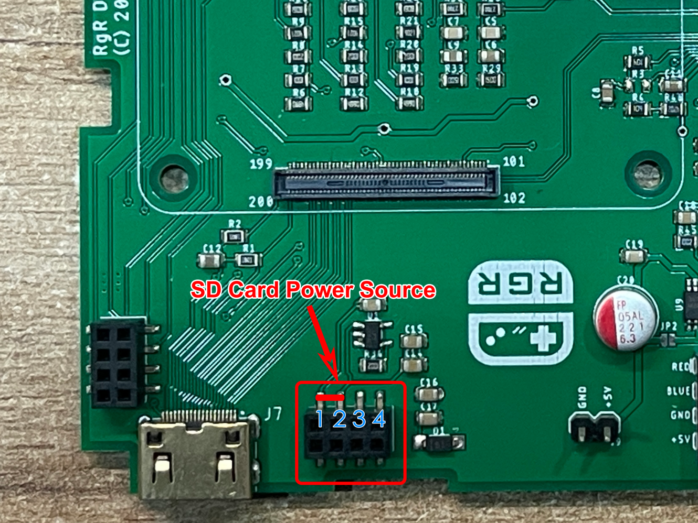

# RGR MiniSS Mainboard RevA/RevB — Modification Instructions for Raspberry Pi CM5

This guide explains how to adapt earlier MiniSS Mainboard revisions (RevA/RevB) for use with Raspberry Pi Compute Module 5 (CM5). Some steps also apply to CM4 Lite.

> **Disclaimer**  
> These are hardware modifications that may void warranty and can damage your board if done improperly. Proceed at your own risk. Always verify voltages with a multimeter before powering the system.

---

## Quick Matrix

| Symptom / Goal                     | Affected Revisions | Section                          | Risk |
|-----------------------------------|--------------------|----------------------------------|------|
| 5V power/voltage insufficient      | RevA, RevB         | [Bypass on-board power switch](#bypass-on-board-power-switch) | Medium |
| SD card not detected (Lite only)   | RevA (very first batch) | [SD power fix (RevA only)](#sd-card-not-detected-reva-only) | Low |

> **Note on boot devices**  
> Only **Lite** models (CM4 Lite / CM5 Lite) boot from SD card. **Non-Lite** models boot from on-board eMMC.

---
# Revisions
**RevA**

- **RevA** — early batch may require the SD power fix below.

**RevB**

- **RevB / RevB2** — use the 5V bypass only if you encounter brown-outs or boot instability with CM5.

---
## Bypass on-board power switch

Some units require a more direct 5V path. This mod disables the on-board power-switch IC by cutting JP1 and shorting JP2, then adding a direct 5V jumper wire.

**Tools:** precision knife, soldering iron, flux, 22–20 AWG wire, multimeter.

1. **Cut JP1** (open-circuit) and **short JP2** (solder bridge).  
   _This effectively bypasses the power-switch IC path._

2. **Locate two 5V points** to be connected.  
   Verify both points read ~5.0 V relative to GND with the multimeter.

3. **Add a 22–20 AWG wire** between the two 5V points.  
   Keep the wire short, avoid sharp bends, and provide strain relief.

4. **Verification:**  
   With power applied, confirm stable 5V at the destination pad under load; check that the board boots normally.

> **Note**  
> After this change, 5V is effectively hard-wired across the path. Ensure upstream supply/USB path and protections are adequate for your use case.

---

## SD card not detected (RevA only)

This applies to the **very first batch of RevA** and primarily affects **CM4 Lite** (SD-boot). Some newer bootloaders changed SD power expectations. With older CM4 Lite bootloaders this wasn’t an issue, but newer bootloaders can expose SD power delivery quirks on the very first RevA batch. If your CM4 Lite still cannot detect the SD card, supply SD power via the following modification.

If there is **no 3.3 V on Pin 2 of the SD power header**, you can **bridge Pin 1 (3.3 V source) to Pin 2 (SD power rail)** to supply SD power directly.

**Steps:**

1. Power **off** the board.
2. Measure Pin 2 (expected 3.3 V when enabled). If **0 V**, proceed.
3. Solder a short jumper from **Pin 1 → Pin 2**.
4. Power on and verify:  
   - Confirm 3.3 V present on Pin 2.  
   - SD card is now detected by the bootloader/OS.

> **Reminder**  
> Non-Lite Compute Modules boot from eMMC and will not use SD, so this fix is unnecessary for them.

---
